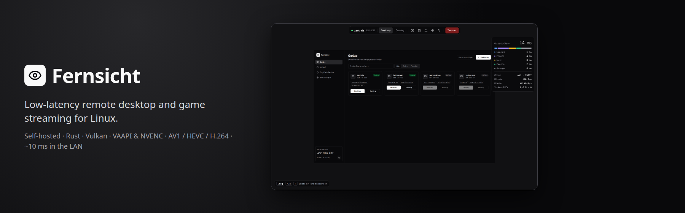
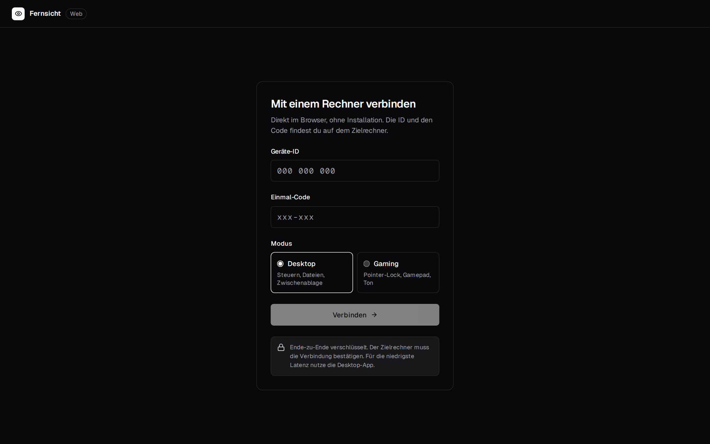
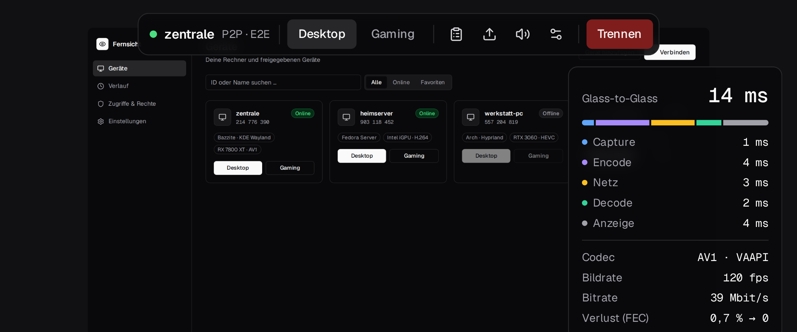
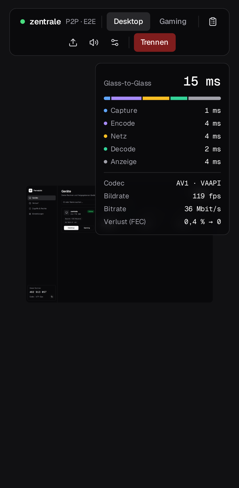

<div align="center">



**Low-latency remote desktop and game streaming for Linux – self-hosted, written in Rust.**<br>
The latency of Sunshine/Moonlight or Parsec, the comfort of TeamViewer: pair once with a PIN, then click and play.<br>
AMD, Intel and NVIDIA · Wayland and X11 · AV1, HEVC and H.264 in hardware · end-to-end encrypted.

[](https://github.com/firsttris/fernsicht/actions/workflows/ci.yml)
[](https://github.com/firsttris/fernsicht/actions/workflows/gpu.yml)
[](https://github.com/firsttris/fernsicht/releases/latest)
[](https://www.rust-lang.org/)
[](https://firsttris.github.io/fernsicht/video.html)
[](LICENSE)

[Install](#-install) •
[Features](#-features) •
[Screenshots](#-screenshots) •
[Performance](#-performance) •
[Compared](#-fernsicht-and-the-alternatives) •
[FAQ](#-faq) •
[Documentation](https://firsttris.github.io/fernsicht/) •
[Development](#️-development)


</div>

## 💡 Why Fernsicht?

- **Fast like a game streamer.** About 10 ms glass-to-glass in the LAN at 1080p60 (without the
  monitor), the screen goes from the GPU to the encoder and from the decoder to the window without a
  single copy through the CPU.
- **Easy like a remote desktop tool.** One app on both computers: it finds the other one in the
  network, you pair once with a 6-digit PIN, then a click starts the session. Or open the host's
  address in any browser, phones included.
- **Made for Linux.** The host captures the screen over KMS, so it works on KDE, GNOME, Hyprland,
  gamescope (Steam's gaming mode) and even the login screen, without a portal dialog.
- **Self-hosted and private.** No account, no cloud service: devices pair directly, every session is
  end-to-end encrypted (Noise IK, as in WireGuard).

> [!NOTE]
> Fernsicht is young. The core works and is tested on real hardware every night, but some parts have
> not been used by many people yet. See the [status](https://firsttris.github.io/fernsicht/status.html)
> for what is done and what was not tried live.

## 🚀 Install

Download the AppImage from the [latest release](https://github.com/firsttris/fernsicht/releases/latest)
and start it on **both** computers:

```sh
chmod +x Fernsicht-*-x86_64.AppImage
./Fernsicht-*-x86_64.AppImage
```

On the computer you want to control, open “Dieser Rechner” (this computer) and click
“Diesen Rechner freigeben” (share this computer): the host runs as a system service from then on.
On the other computer the host shows up in the list; pair with the PIN and click **Desktop** or
**Gaming**. The app's interface is in German for now.

Building from source, the host as a service without the app, the browser and everything else:
the [installation guide](https://firsttris.github.io/fernsicht/installation.html).

### 🐧 Runs on

| | | Notes |
|---|---|---|
| ✅ | AMD (RADV, VAAPI) | host and client, AV1/HEVC/H.264 with an RX 6000/7000 and newer |
| ✅ | NVIDIA (proprietary driver) | host (NVENC, screen via Vulkan → CUDA) and client (NVDEC); GTX 10xx and newer |
| ✅ | Intel (iHD, VAAPI) | the same path as AMD; not tested on real hardware yet |
| ✅ | Bazzite, Fedora, other distributions with systemd | developed and tested on Bazzite 44 (KDE Wayland) |
| 🌐 | Any browser | the web viewer: Chrome, Edge, Firefox, Safari, phones and tablets |
| ⏳ | Windows and macOS | not planned for now: the host is Linux, clients are the app on Linux or a browser |

## ✨ Features

| | |
|---|---|
| 🖥️ **Remote desktop** | Mouse and keyboard reliably over UDP, every event exactly once; the pointer drawn by the client so it never lags; several monitors with switching in the session; system keys (Meta, Alt+Tab, Ctrl+Alt+Del) in fullscreen or from a menu |
| 🎮 **Game streaming** | Gaming mode with a captured pointer (relative mouse), up to four controllers that appear on the host as Xbox 360 pads Steam knows, 60 to 144 fps |
| ⚡ **Low latency** | KMS capture at vblank, zero-copy into VAAPI or NVENC, low-latency encoder settings, Reed-Solomon FEC instead of retransmits, paced UDP, decoded pictures straight into Vulkan, a per-stage latency overlay |
| 🎞️ **AV1, HEVC, H.264** | Each session takes the best codec both sides do in hardware; switchable in the settings |
| 🔊 **Sound** | What the host plays, Opus with 5 ms frames, a 15 ms jitter buffer that hides loss |
| 🔐 **Pairing and encryption** | Pair once with a PIN (SPAKE2, no offline guessing), Noise IK per session, ChaCha20-Poly1305 for every packet, only paired devices get in |
| 🌐 **Web viewer** | The host serves it itself: any browser in the LAN, PIN once, WebRTC with AV1 or H.264; on phones with gestures, touchpad mode, pinch zoom and the on-screen keyboard |
| 📶 **Bad networks** | Forward error correction sized from the measured loss, bitrate adaptation on congestion; 1 % loss costs no frame |
| 🧰 **Host as a service** | systemd unit, encoder picked for the GPU, GPU clocks raised during sessions, pairing and status from the app or the command line |

## 📸 Screenshots

<table>
  <tr>
    <td width="50%"><br><sub><b>Devices</b> – found in the LAN, paired with a PIN · <a href="https://firsttris.github.io/fernsicht/app.html">docs →</a></sub></td>
    <td width="50%"><br><sub><b>Settings</b> – resolution, fps, bitrate, codec · <a href="https://firsttris.github.io/fernsicht/app.html#settings">docs →</a></sub></td>
  </tr>
  <tr>
    <td><br><sub><b>Connect</b> – by name, address or ID · <a href="https://firsttris.github.io/fernsicht/app.html">docs →</a></sub></td>
    <td><br><sub><b>Web viewer</b> – no install, PIN once · <a href="https://firsttris.github.io/fernsicht/web-viewer.html">docs →</a></sub></td>
  </tr>
  <tr>
    <td><br><sub><b>On a phone</b> – gestures, zoom, on-screen keyboard · <a href="https://firsttris.github.io/fernsicht/web-viewer.html#phones-and-tablets">docs →</a></sub></td>
    <td><br><sub><b>Portrait</b> – the toolbar wraps, the picture fits · <a href="https://firsttris.github.io/fernsicht/web-viewer.html">docs →</a></sub></td>
  </tr>
</table>

## 📈 Performance

Measured end to end on the two test machines, without the monitor's own delay
(details and what can still get faster: [performance](https://firsttris.github.io/fernsicht/performance.html)):

| Path | Glass-to-glass |
|---|---|
| Loopback, AMD RX 7800 XT, H.264 1080p60 | ≈ 9.4 ms |
| GTX 1080, NVENC → NVDEC, HEVC 1080p60 | ≈ 4.1 ms |
| AMD host → NVIDIA client over Wi-Fi, 1080p | 11.5 ms |
| AMD host → NVIDIA client over Wi-Fi, 1440p | 16.3 ms |

At the same bitrate HEVC gives a clearly sharper picture than H.264 (GTX 1080, 4 Mbit/s 1080p:
32.4 dB instead of 29.1 dB PSNR with a third of the bytes). Every step of the path is shown live in
the overlay: capture, encode, network, decode, display.

## 🆚 Fernsicht and the alternatives

| | Fernsicht | Sunshine + Moonlight | Parsec | RustDesk |
|---|---|---|---|---|
| Linux host | ✅ KMS, also login screen and gamescope | ✅ | ❌ | ✅ |
| Latency focus | ✅ zero-copy, FEC, per-stage overlay | ✅ | ✅ | ➖ |
| Remote desktop comfort (find, pair, click) | ✅ | ➖ pairing per client, made for games | ✅ | ✅ |
| Browser client | ✅ built into the host | ❌ | ❌ | ➖ web client |
| Account or cloud | none | none | required | optional relay server |
| Over the internet | via VPN for now ([how](https://firsttris.github.io/fernsicht/remote-access.html)) | port forwarding | ✅ | ✅ |
| Windows/macOS | ❌ | ✅ | ✅ | ✅ |

A latency comparison with Sunshine/Moonlight on the same machines is planned
([method](https://firsttris.github.io/fernsicht/latency-baseline.html)).

## ❓ FAQ

<details>
<summary><b>Does it work on Wayland?</b></summary>

Yes. The host does not depend on the compositor: it reads the screen over KMS (kernel mode setting),
the same way on KDE Plasma, GNOME, Hyprland, Sway, gamescope and X11. That needs root
(`CAP_SYS_ADMIN`), which the system service has. The client window runs on Wayland and X11.
</details>

<details>
<summary><b>Does it work with NVIDIA?</b></summary>

Yes, with the proprietary driver: NVENC on the host (the screen goes from KMS through Vulkan into
CUDA, without a CPU copy) and NVDEC in the client. Tested on a GTX 1080.
</details>

<details>
<summary><b>Can I use it over the internet?</b></summary>

Today through a VPN such as Tailscale or WireGuard (or Cloudflare WARP): then it works as in the LAN.
Built-in NAT traversal is on the [roadmap](https://firsttris.github.io/fernsicht/next-steps.html).
See [remote access](https://firsttris.github.io/fernsicht/remote-access.html).
</details>

<details>
<summary><b>Is it a Sunshine or Moonlight replacement for gaming?</b></summary>

For Linux to Linux and browsers, yes in intent: gaming mode, controllers, 120 Hz and more, AV1/HEVC.
It does not speak the Moonlight protocol, so Moonlight clients cannot connect.
</details>

<details>
<summary><b>Is it secure?</b></summary>

Only paired devices can connect. Pairing uses a 6-digit PIN with SPAKE2 (a recorded pairing cannot be
used to guess the PIN), each session starts with a Noise IK handshake, and every packet is encrypted
and authenticated. The web viewer is meant for the LAN: its page and PIN travel over plain HTTP. See
[security](https://firsttris.github.io/fernsicht/security.html).
</details>

<details>
<summary><b>Which codec does it use?</b></summary>

The best both sides support in hardware: AV1, then HEVC, then H.264. A GTX 1080 decodes no AV1, so
it gets HEVC; a browser offering AV1 gets AV1 from an AMD RX 6000/7000. You can also pick one in the
settings.
</details>

## 📚 Documentation

Everything else – installation, the app, the web viewer, the host, how it works inside, the protocol,
security, performance and the roadmap – is in the **[documentation](https://firsttris.github.io/fernsicht/)**.

## 🛠️ Development

```sh
cargo build --release                       # host and client (test pattern, synthetic codec)
cargo test --workspace                      # unit, property, integration, end-to-end
pnpm install && pnpm test && pnpm test:e2e  # app UI and web viewer
```

On Bazzite, `dev/setup.sh` builds the development container with FFmpeg, Vulkan and the GPU drivers.
Build features, the test layers, the GPU runners and the release flow are in the
[development guide](https://firsttris.github.io/fernsicht/development.html).

---

<div align="center">

⭐ Like Fernsicht? A [star on GitHub](https://github.com/firsttris/fernsicht) helps others find it.<br>
🐛 [Report a bug](https://github.com/firsttris/fernsicht/issues/new) · 💡 [Request a feature](https://github.com/firsttris/fernsicht/issues/new)

<sub>License: <a href="LICENSE">AGPL-3.0</a> · © Tristan Teufel and contributors<br>
Changed versions you pass on or run for others must offer their source code under the AGPL; a commercial license without these obligations is available via <a href="https://teufel-it.de">teufel-it.de</a>.<br>
Fernsicht is not affiliated with Valve, NVIDIA, AMD, Intel, Parsec, Moonlight, Sunshine, RustDesk or TeamViewer.</sub>

</div>
