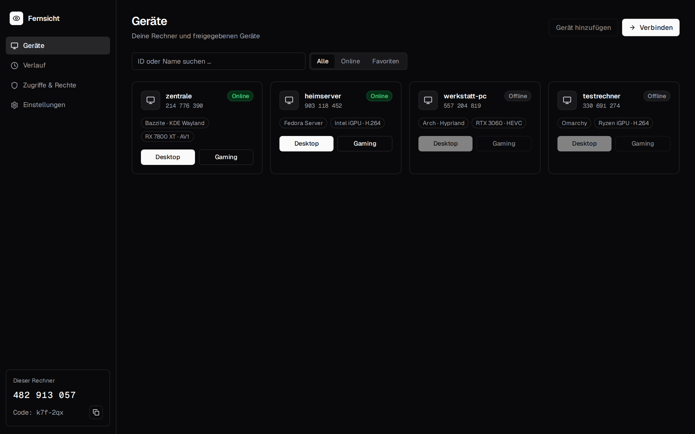
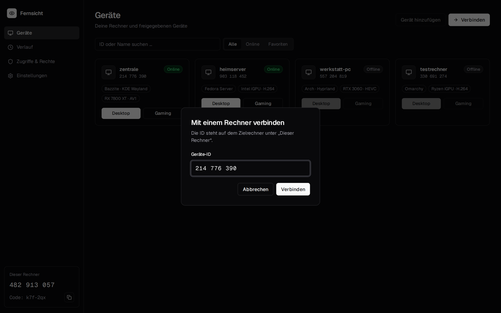
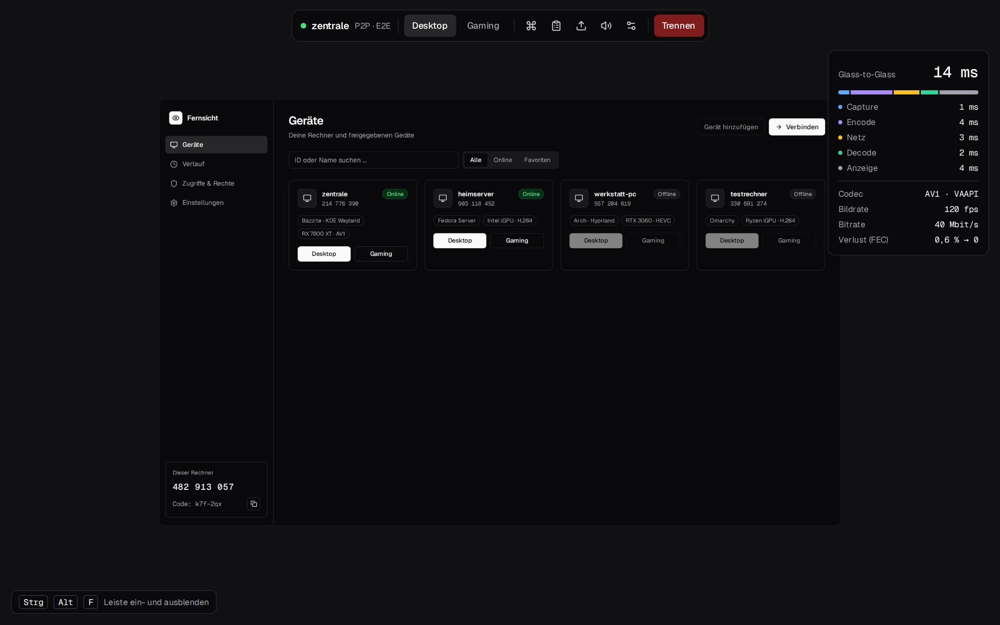
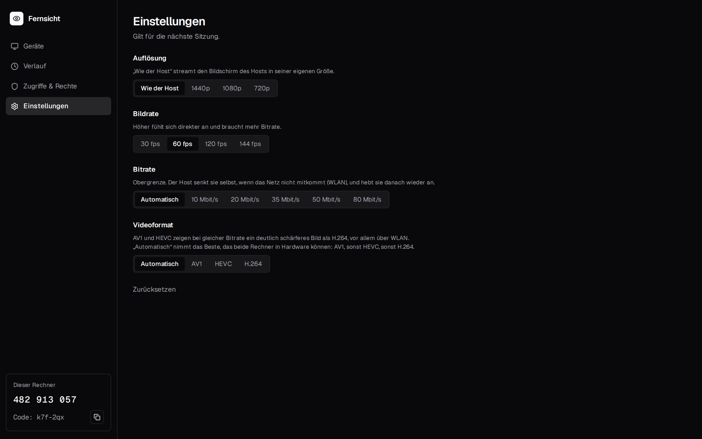

# The app

The Fernsicht app lists the computers in your network, pairs with them and starts sessions. The
picture opens in its own window (Vulkan); the app shows the session's controls and the latency
overlay next to it. The interface is in German for now; the labels below are given in German with
their meaning.

Install it as described in the [installation guide](installation.md). On a computer you also want
to control, the app sets up the host service as well (“Diesen Rechner freigeben”).

## Devices

“Geräte” (devices) shows every host the app found in the LAN and every host you paired with, paired
ones first:

- **Online / Offline**, the operating system, the GPU and its best codec, “Kopplung offen” (pairing
  open, a PIN is shown there now) and “In Benutzung” (in use by someone else).
- Search by name or ID (“ID oder Name suchen …”), filter with “Alle”, “Online”, “Favoriten” (all,
  online, favourites).
- **Desktop** and **Gaming** start a session in that mode.
- “Gerät vergessen” (forget device) removes a paired host here; it has to be paired again.
- The list refreshes every 5 seconds. The computer's own host is not listed: it is “Dieser Rechner”
  (this computer) at the bottom of the sidebar.

Discovery is a broadcast on UDP 47800 and only reaches the local network. Hosts you paired with are
also asked directly at their last address, so they show up through a VPN too
([remote access](remote-access.md)).

“Verbinden” (connect) opens a dialog for a name, address or device ID:

## Pairing

Once per pair of devices:

1. On the computer to control: “Dieser Rechner” → “Gerät koppeln” (pair a device). It shows a
   6-digit PIN for 5 minutes (“PIN für das neue Gerät”). On a host without the app:
   `fernsicht-host-agent pair`.
2. On the other computer: the host shows “Kopplung offen”; click “Koppeln” (pair) and enter the PIN.

From then on the two know each other's keys and every session is encrypted. Three wrong PINs close
the pairing. How it works: [security](security.md).

## Sharing this computer

Under “Dieser Rechner” (this computer):

- “Diesen Rechner freigeben” (share this computer) installs the host from the AppImage as the system
  service `fernsicht-host` (KDE asks for your password).
- “Host aktualisieren auf …” (update the host to …) appears when the app carries a newer host than
  the installed one.
- “Freigabe beenden” (stop sharing) removes the service again.

## A session

The picture opens in its own window. While input goes to the host, the window keeps a few key
combinations for itself:

| Keys | |
|---|---|
| Ctrl+Alt+Shift+F | fullscreen on and off |
| Ctrl+Alt+Shift+M | capture the pointer, or let it go |
| Ctrl+Alt+Shift+← / → | the host's previous / next monitor |
| Ctrl+Alt+Shift+Q | end the session |

Watching only (`--view-only`): Esc closes, F11 toggles fullscreen, PageUp/PageDown switch monitors.

The app's session page has the toolbar:

- **Desktop / Gaming** switches the mode during the session.
- “Tasten senden” (send keys) sends Ctrl+Alt+Del, the Windows key, Windows+W, Alt+Tab, Alt+F4 or
  Print to the host.
- “Bildschirm wählen” (choose screen), with two or more monitors on the host: switch the monitor
  shown. The pointer follows.
- Sound on and off; “Trennen” (disconnect).
- “Zwischenablage” (clipboard) and “Dateien senden” (send files) are not built yet.

### Latency overlay

The overlay shows glass-to-glass latency and its stages – Capture, Encode, “Netz” (network), Decode,
“Anzeige” (display) – plus the codec and its hardware, frame rate, bitrate and loss before and after
FEC. Glass-to-glass here is measured up to the moment the picture is handed to the window; the
monitor's own delay comes on top ([architecture](architecture.md#latency-measurement)).

### Desktop and gaming mode

- **Desktop:** the pointer moves absolutely, the host's pointer is drawn in the picture.
- **Gaming:** a click into the window captures the pointer; it then moves relatively, as games want
  it. Ctrl+Alt+Shift+M lets it go.

### System keys

The desktop the app runs on keeps keys such as Meta, Meta+W, Alt+Tab and Ctrl+Alt+Del for itself.
While the window has the focus **and** is fullscreen or holds the pointer, it asks the desktop to
pass them to the host instead (Wayland `keyboard-shortcuts-inhibit`; KDE asks once whether to allow
it; on X11 a keyboard grab). In a plain window Alt+Tab stays local, so you can always get out. When
the desktop refuses, the “Tasten senden” menu still works.

### Gamepads

Up to four controllers on the client become virtual Xbox 360 controllers on the host (“Fernsicht
X-Box 360 pad 1” …), which Steam and games use without setup. `--no-gamepad` leaves them out.

## Settings

“Einstellungen” (settings) apply to the next session:

| Setting | |
|---|---|
| “Auflösung” (resolution) | “Wie der Host” (as the host: its screen's own size), 1440p, 1080p, 720p |
| “Bildrate” (frame rate) | 30, 60, 120, 144 fps |
| “Bitrate” | “Automatisch” (chosen by the host for the size: about 20 Mbit/s for 1080p60, 36 for 1440p60) or 10–80 Mbit/s. An upper bound: the host lowers it by itself on congestion |
| “Videoformat” (video format) | “Automatisch” (the best both computers do in hardware: AV1, then HEVC, then H.264), AV1, HEVC, H.264 ([codecs](video.md#codecs)) |

With a host on this computer there is one more section, “Dieser Rechner als Host” (this computer as
host): “Grafikkarte während Sitzungen hochtakten” (raise the GPU's clocks during sessions). Between
two frames a GPU clocks down and the next frame takes longer to encode; while a session runs the
host keeps it at full clocks and restores everything afterwards (AMD and Intel).
