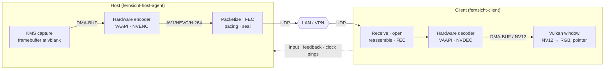
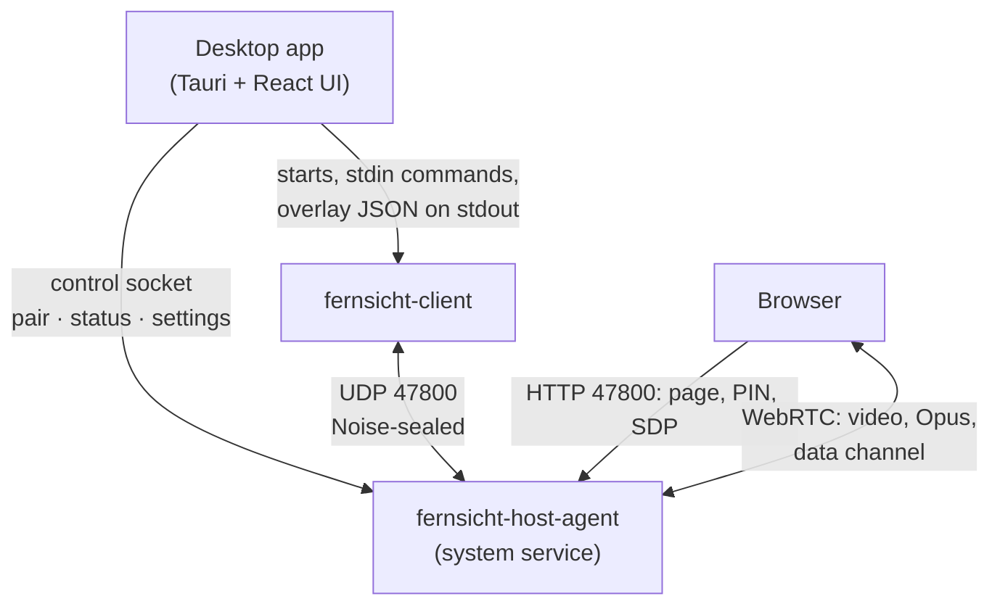

# Architecture

Fernsicht is two programs and a protocol between them. The host reads the screen, encodes it and
sends it; the client receives, decodes and shows it, and sends input back. Everything time-critical
runs on dedicated threads, the picture stays on the GPU from capture to display, and every stage is
measured.

## The picture's way



- **Capture.** The host waits for the vblank of the monitor's CRTC, reads which framebuffer the
  primary plane shows and exports it as a DMA-BUF. No pixel is copied ([KMS capture](kms-capture.md)).
- **Encode.** The DMA-BUF goes straight to the hardware encoder: on AMD/Intel the VAAPI video
  processor converts RGB to NV12 and scales; on NVIDIA a Vulkan compute shader converts into memory
  CUDA has imported, and CUDA copies it into NVENC's input ([video path](video.md)).
- **Transport.** Each encoded frame is split into datagrams, protected by Reed-Solomon FEC sized from
  the measured loss, spread over time by the pacer and sealed with the session key
  ([protocol](protocol.md)).
- **Decode and show.** The client reassembles the frame, repairs it with FEC if needed, decodes it in
  hardware and draws the decoded picture with Vulkan; with VAAPI the decoded surface is imported
  without a copy. The host's pointer is drawn over it from its own packets.

## Threads

```text
Host:   [capture] --slot(1)--> [encode] --fifo(2)--> [packetize + FEC + pacing + send]
        [control]  Hello/Ack, Clock-Pong, Feedback → FEC sizing, keyframe, bitrate; input → uinput
        [audio]    PipeWire capture → Opus → send
        [webrtc]   one per browser session (str0m)
Client: [network] --fifo(4)--> [decode] --latest wins--> [present]
        [audio]    jitter buffer → Opus → speakers
        [window]   winit event loop: input, monitor and mode switches
```

Every stage runs on its own OS thread with raised priority. After warming up nothing is allocated:
frame buffers circle through small free lists.

"Latest frame wins" applies only to *raw* and *decoded* frames: the slot between capture and encode
holds one frame, and a newer capture replaces an unconsumed one, which costs nothing. *Compressed*
frames depend on each other and therefore go through a short FIFO. If it overflows, a gap in the frame
ID shows it, and the client asks for a keyframe.

## Latency measurement

The host writes the capture time and the offsets to "capture ready" and "encode done" into every
packet header. The client measures arrival, decode and display itself and converts everything to one
time axis with the estimated clock offset. For the offset, the probe with the smallest round-trip time
among the last 16 counts (NTP-style: ping, pong with the host's receive and send times). The stages
have the same names as in the UI: Capture, Encode, “Netz” (network), Decode, “Anzeige” (display).

The overlay measures up to the hand-off to the window. The monitor's scan-out is not included; the
acceptance test for glass-to-glass is a phone's slow-motion camera filming both screens
([latency baseline](latency-baseline.md)).

## Control and feedback

- The client sends **feedback** every 100 ms: frames completed and dropped, packets received, lost
  and recovered, whether it needs a keyframe or the pointer's image. The host sizes FEC from the loss
  and adapts the bitrate when frames are lost despite FEC ([performance](performance.md)).
- **Input** (mouse, keys, gamepads) is retransmitted until the host acknowledges it, and every event
  is applied exactly once ([protocol](protocol.md#input)).
- **Monitor and codec choice** are negotiated at the start (Hello) and switched in the session
  (SelectMonitor).

## The pieces around it



- **The app** (`apps/desktop`, Tauri around `apps/client-ui`) lists devices (discovery broadcast plus
  paired hosts), pairs, and starts `fernsicht-client --app` for a session. It reads the overlay as
  JSON lines from the client's stdout and sends commands on its stdin (mute, mode, keys, monitor).
- **The host service** has a local control socket (`/run/fernsicht/control.sock`): the app and
  `fernsicht-host-agent pair|status|unpair` use it to open pairing, read the status and change
  settings.
- **The web viewer** is a static page the host serves; the browser posts its WebRTC offer with the
  PIN, the host answers and streams over WebRTC (str0m) from the same encoder.

Every crate and package is described in [modules](modules.md).
