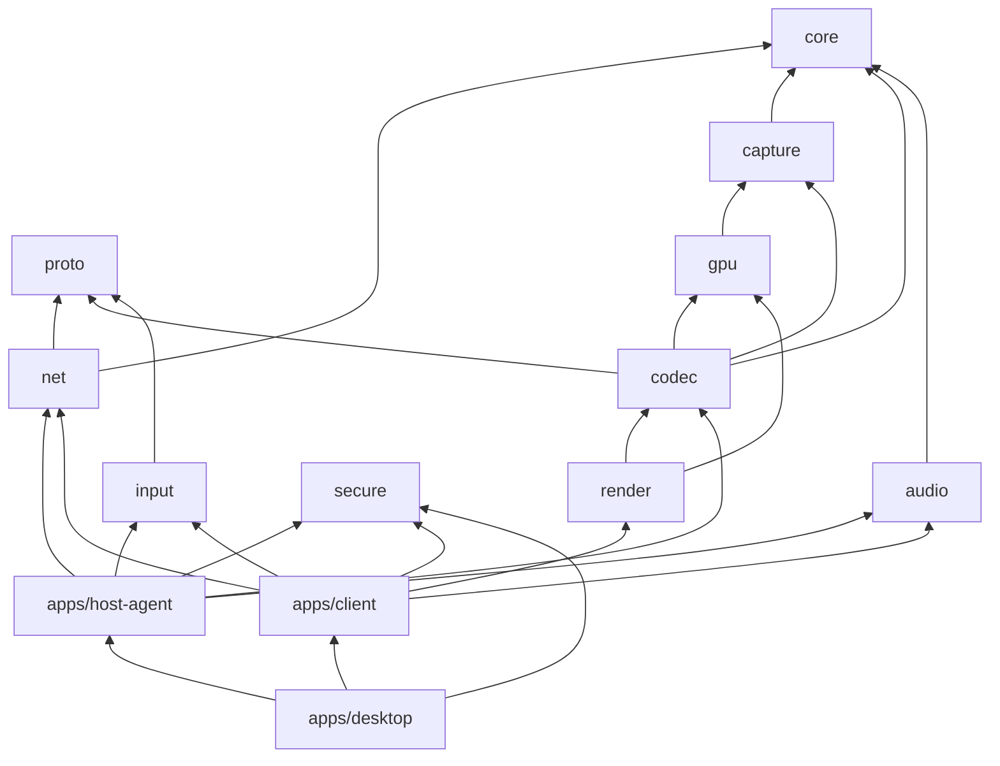

# Modules

The repository is a Cargo workspace for the Rust side and a pnpm workspace for the web side.

```text
crates/   core · proto · net · capture · gpu · codec · render · input · audio · secure
apps/     host-agent · client · client-ui · desktop
web/      ui · viewer · e2e
tests/    e2e (host and client through an impaired network)
fuzz/     cargo-fuzz targets
dev/      Distrobox containers for Bazzite, GPU runner setup
packaging/ AppImage, install scripts, systemd unit
```

## How they depend on each other



## Crates

| Crate | What it does |
|---|---|
| `core` | The slot with capacity 1 (latest frame wins, buffer recycling), the monotonic clock, latency statistics per stage, hot threads with raised priority, system info for discovery |
| `proto` | The UDP packet format v1: video shards with stage timestamps, feedback, clock ping/pong, hello/ack with the codec set, bye, pointer, input, audio, handshake, sealed packets, pairing, discovery, monitors. The parser never panics and never allocates ([protocol](protocol.md)) |
| `net` | Reed-Solomon FEC (`reed-solomon-simd`) in groups; recovery shards per group sized binomially from the measured loss (group failure ≤ 10⁻⁵); reassembly with keyframe requests and hard size limits; the pacer; NTP-style clock sync; UDP sockets with 4 MiB buffers; bitrate adaptation; loss simulation |
| `capture` | The `FrameSource` trait, the test pattern (NV12, a moving bar, a circling pointer), the DMA-BUF description, KMS capture at vblank with the cursor plane and monitor switching (feature `kms`, pure Rust) |
| `gpu` | The Vulkan device and DMA-BUF import without a copy (for the renderer and the encoder); RGB DMA-BUF → NV12 by a compute shader, exported to CUDA for NVENC; test images exported as DMA-BUFs |
| `codec` | The `Encoder`/`Decoder` traits, the synthetic codec, VAAPI encode and decode of H.264, HEVC and AV1 through FFmpeg (feature `vaapi`, DMA-BUF import, RGB → NV12 and scaling by `scale_vaapi`), NVENC/NVDEC (feature `nvidia`, screen through Vulkan → CUDA), hardware capability queries |
| `render` | The `Presenter` trait, overlay formatting, the Vulkan renderer (NV12 from the CPU or a DMA-BUF → RGB, letterboxing, the pointer) and the window presenter (feature `window`) |
| `input` | Input events, the duplicate filter, `uinput` devices on the host (mouse, keyboard, Xbox 360 pads), evdev gamepads on the client |
| `audio` | Capture and playback through PipeWire's PulseAudio interface, Opus (48 kHz stereo, 5 ms frames, low delay), the client's jitter buffer, a test tone; libopus and libpulse are loaded at runtime |
| `secure` | Device keys (X25519), the list of paired devices, pairing with SPAKE2, Noise IK sessions, the replay window ([security](security.md)) |

## Apps

| App | What it does |
|---|---|
| `apps/host-agent` | `fernsicht-host-agent`: sessions, the control socket (`control.rs`), the web viewer and WebRTC (`web.rs`), the monitor arrangement for input mapping (`layout.rs`), GPU clocks during sessions (`power.rs`) |
| `apps/client` | `fernsicht-client`: the network loop, decoding, presenting, discovery (`discover.rs`), the pointer (`cursor.rs`), the window with its keys and system-shortcut lock (`main.rs`, `shortcuts.rs`) |
| `apps/client-ui` | The app's interface (React 19, TanStack Router and Query, Tailwind, shadcn-style components); demo data in a browser, the real backend in the app |
| `apps/desktop` | The Tauri app around `client-ui`: devices, pairing, sessions through the client (`backend.rs`), sharing this computer from the AppImage (`share.rs`). Its own Cargo workspace (it needs WebKitGTK) |

## Web

| Package | What it does |
|---|---|
| `web/ui` | Shared components: the session view with toolbar and menus, the latency overlay, primitives, demo data |
| `web/viewer` | The web viewer: connect page, WebRTC session, pointer, mouse, keyboard, gamepads, touch gestures (`lib/touch.ts`), on-screen keyboard (`lib/textkeys.ts`), fullscreen with Keyboard Lock |
| `web/e2e` | Playwright tests (desktop, phone, phone in landscape, accessibility with axe) and the screenshot script |

## Build features

| Feature | Crates | |
|---|---|---|
| `vaapi` | codec, host-agent, client, e2e | hardware video on AMD/Intel; needs FFmpeg and libva headers |
| `nvidia` | codec, host-agent, client, e2e | NVENC/NVDEC; CUDA is loaded at runtime, builds without the driver |
| `kms` | capture, host-agent | screen capture over KMS |
| `window` | render, client | the Vulkan window (winit) |
| `vulkan` | render | the renderer without a window (tests) |

Without features the whole pipeline runs with the test pattern and the synthetic codec, so CI and
machines without a GPU test transport, FEC, pacing and latency for real.
